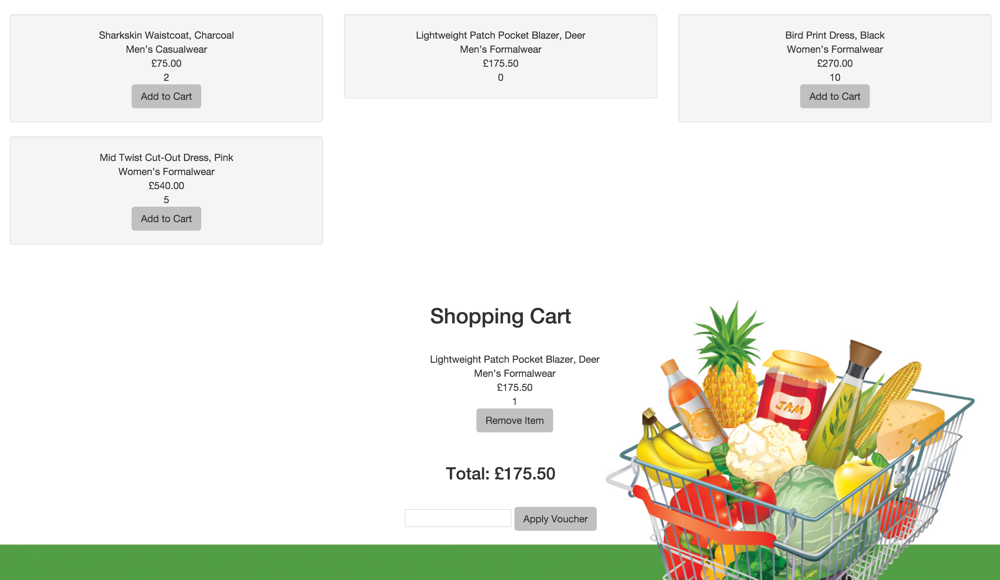

Shopping Cart
=============

Continuous Integration
----------------------
Master: 

Description
------------

A simple shopping website built with Javascript (Angular, Jasmine, Karma, Protractor), HTML 5 and CSS 3(BootStrap).



User Guide
----------

To run this website locally, clone this repository, ensure you have node and bower installed:
```
brew install node  
npm install bower -g
```
Then install all the project dependencies:
```
npm install
bower install
```
a local server can then be run using the command
```
npm start
```
and visited in any browser by going to the following URL:
```
http://127.0.0.1:8080
```
If you would like a discount simply submit one of the following promo codes: `PROMO1`, `PROMO2`, `PROMO3`.

Unit tests can be run using:
```
npm test
```
In order to run full end to end testing open three terminal windows and run the following commands in each:
```
npm start
webdriver-manager start
protractor test/e2e/conf.js
```


Completed Features
-----------------
- As a User I can see a list of products displayed on the site.
- As a User I can see my shopping cart.
- As a User I can add a product to my shopping cart.
- As a User I can remove a product from my shopping cart.
- As a User I can view the total price for the products in my shopping
cart.
- As a User I am unable to add Out of Stock products to the shopping cart.
- As a User I can apply a voucher to my shopping cart.
- As a User I can view the total price for the products in my shopping cart
with discounts applied.
- As a User I am alerted when I apply an invalid voucher to my shopping
cart.
- Add basic Styling.

Work left to do
---------------------

- refactor controller
- improve UI
